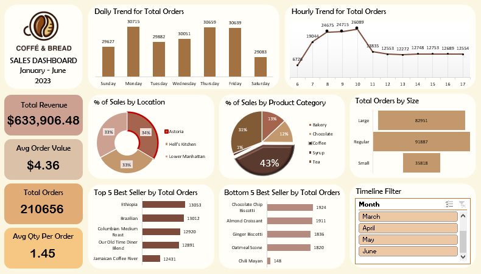

# Coffee and Bread Sales Dashboard
Dashboard ini menganalisis penjualan produk kopi dan roti selama Januari–Juni 2023 dengan total 145.406 baris data. Visualisasi dibuat menggunakan **Microsoft Excel** untuk memantau tren harian, waktu pembelian, dan performa produk.

---

## 🔗 Please download the excel file to see the live dashboard
[**View Dashboard**](coffee_sales.xlsx)

---

### 📊 **INSIGHT DARI DASHBOARD**

1. **Total Revenue & Penjualan**

   * Total pendapatan: **\$633,906.48**
   * Jumlah pesanan: **210,656 order** dengan **rata-rata 1.45 produk per order**
   * Rata-rata nilai transaksi: **\$4.36**

2. **Tren Harian Penjualan**

   * Hari dengan order tertinggi: **Kamis (36,059 orders)**
   * Hari dengan order terendah: **Sabtu (29,083 orders)**

3. **Tren Jam Penjualan**

   * Jam sibuk: **08.00–10.00 pagi**, dengan puncaknya pukul **09.00 (26,089 orders)**
   * Setelah pukul 10, penjualan menurun tajam dan stabil.

4. **Distribusi Penjualan per Lokasi**

   * Penjualan merata di tiga lokasi:

     * Astoria: 34%
     * Hell’s Kitchen: 33%
     * Lower Manhattan: 33%

5. **Kategori Produk Terlaris**

   * **Coffee** menyumbang 43% dari total penjualan — kategori produk paling dominan.
   * Bakery dan Chocolate menyusul di bawahnya.

6. **Ukuran Pesanan**

   * Ukuran **regular** mendominasi (91,887 orders), disusul **large** (82,951) dan **small** (35,818)

7. **Produk Terlaris & Tidak Laris**

   * Produk terlaris: **Ethiopia** dan **Brazilian Coffee**
   * Produk kurang laku: **Chili Mayan**, **Oatmeal Scone**

---

### 💡 **Rekomendasi Bisnis**

1. **Promosi di Jam Sepi**

   * Lakukan diskon/promo **setelah jam 10 pagi** untuk mendorong penjualan di waktu sepi.
   * Misal: *“Buy 1 Get 1” mulai jam 11 siang.*

2. **Optimalkan Penjualan Hari Sabtu**

   * Tambahkan promosi spesial di hari Sabtu agar penjualan meningkat — seperti *Weekend Combo*.

3. **Tingkatkan Penjualan Produk Tidak Laris**

   * Buat bundling produk yang kurang laku (seperti Chili Mayan) dengan produk favorit (seperti Ethiopia).

4. **Fokus pada Lokasi Astoria**

   * Astoria menunjukkan performa tertinggi, bisa diprioritaskan untuk peluncuran menu baru.

5. **Inovasi pada Produk Ukuran Kecil**

   * Ukuran small paling sedikit dipesan — mungkin bisa disesuaikan dengan harga/value, atau dijadikan bagian dari paket.

6. **Diversifikasi Produk Non-Kopi**

   * Coffee mendominasi, namun penting untuk memperkuat kategori Bakery dan Tea sebagai alternatif produk.

---
